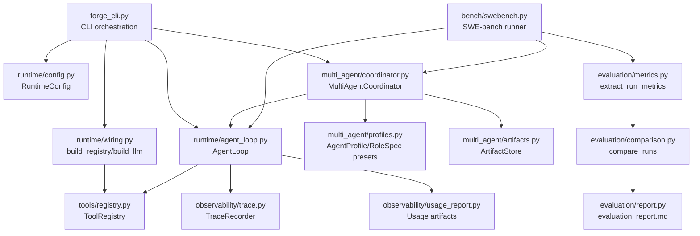

# Core Code Dependency Map Implementation Plan

> **For agentic workers:** REQUIRED SUB-SKILL: Use superpowers:subagent-driven-development (recommended) or superpowers:executing-plans to implement this plan task-by-task. Steps use checkbox (`- [ ]`) syntax for tracking.

**Goal:** Create a concise Chinese dependency-map document that identifies NanoHarness / Agent Forge's smallest high-value core code set, dependencies, runtime flows, and interview explanation path.

**Architecture:** This is documentation-only. The document should live under `docs/technical-defense/` and complement the existing multi-agent learning guide by focusing less on how to study and more on the minimum design/code graph. It should prioritize a small core file set, dependency diagrams, and what to read or skip in each file.

**Tech Stack:** Markdown, Mermaid diagrams, existing Python package structure.

## Global Constraints

- Do not change runtime code.
- Write the final document in Chinese.
- Keep it minimal and high-signal, not a complete API reference.
- Include dependency relationships and three main flows: single-agent, multi-agent, compare/evaluation.
- Include interview framing and what to skip while learning.
- Do not claim official SWE-bench resolved-rate.

---

## File Structure

- Create: `docs/technical-defense/核心代码依赖关系学习图谱.md`
  - Responsible for smallest core file set, dependency graph, run-flow graph, file-by-file reading guidance, and interview framing.

---

### Task 1: Write core code dependency map

**Files:**
- Create: `docs/technical-defense/核心代码依赖关系学习图谱.md`

**Interfaces:**
- Consumes: Existing package paths and concepts: CLI, runtime, tools, observability, multi-agent, benchmark, evaluation.
- Produces: A standalone Markdown document for learning and interview prep.

- [ ] **Step 1: Write the dependency-map document**

Write this exact document to `docs/technical-defense/核心代码依赖关系学习图谱.md`:

```markdown
# Agent Forge 核心代码依赖图：最少而精版本

> 目标：只抓住最核心的设计代码和依赖关系，避免从文件树开始盲看。读完这份文档后，你应该能用 10～15 个文件讲清楚 Agent Forge 的 single-agent、multi-agent、compare/evaluation 三条主流程。

## 0. 这不是全量架构图

这份文档刻意不覆盖所有文件。它只回答一个问题：

> 如果我要最快学懂这个项目，并在面试中讲出“我理解它的设计”，最少应该看哪些代码？它们之间是什么关系？

第一遍学习时，先忽略 UI、TUI、provider 细节、完整 Skill governance、官方 SWE-bench Docker harness 细节。先把核心闭环看懂。

---

## 1. 最小核心链路

项目最小核心可以压缩成这条链：

```text
CLI
 -> RuntimeConfig / Registry / LLM wiring
 -> AgentLoop
 -> Tool execution + Trace + Usage
 -> MultiAgentCoordinator
 -> ArtifactStore
 -> SWE-bench compare
 -> Evaluation report
```

对应到代码：

```text
agent_forge/forge_cli.py
agent_forge/runtime/config.py
agent_forge/runtime/wiring.py
agent_forge/runtime/agent_loop.py
agent_forge/tools/registry.py
agent_forge/observability/trace.py
agent_forge/observability/usage_report.py
agent_forge/multi_agent/coordinator.py
agent_forge/multi_agent/profiles.py
agent_forge/multi_agent/artifacts.py
agent_forge/bench/swebench.py
agent_forge/evaluation/metrics.py
agent_forge/evaluation/comparison.py
agent_forge/evaluation/report.py
```

如果你只能看一组文件，就看这 14 个。

---

## 2. 核心依赖关系图



这张图的核心含义：

1. `AgentLoop` 是唯一 canonical runtime。
2. `MultiAgentCoordinator` 依赖 `AgentLoop`，不是替代 `AgentLoop`。
3. `ToolRegistry` 是模型行为和真实工具执行之间的边界。
4. `TraceRecorder` / usage report 是可观测性边界。
5. `bench/swebench.py` 同时能跑 single 和 multi，并把结果交给 evaluation 层。
6. `evaluation/` 不执行 agent，只做证据归一化和报告。

---

## 3. 文件分层：哪些必须看，哪些以后再看

### 3.1 必须掌握：最小核心 14 文件

| 层 | 文件 | 你要掌握的问题 |
| --- | --- | --- |
| CLI | `agent_forge/forge_cli.py` | 用户命令如何进入 single/multi runtime？ |
| Runtime config | `agent_forge/runtime/config.py` | 一次 run 的 workspace、steps、trace、approval 如何配置？ |
| Wiring | `agent_forge/runtime/wiring.py` | registry 和 LLM client 如何组装？ |
| Runtime loop | `agent_forge/runtime/agent_loop.py` | agent 如何 call model、call tool、observe、结束？ |
| Tools | `agent_forge/tools/registry.py` | 工具如何注册、过滤、执行？ |
| Observability | `agent_forge/observability/trace.py` | trace 如何记录一次 agent run？ |
| Observability | `agent_forge/observability/usage_report.py` | token/cost/tool 统计如何变成 report？ |
| Multi-agent | `agent_forge/multi_agent/coordinator.py` | roles 如何顺序执行和 revision？ |
| Multi-agent | `agent_forge/multi_agent/profiles.py` | coding_fix/research_report 的 role 和 tool allowlist 怎么定义？ |
| Multi-agent | `agent_forge/multi_agent/artifacts.py` | role 输出如何落盘并交接？ |
| Benchmark | `agent_forge/bench/swebench.py` | SWE-bench case 如何跑 single/multi/compare？ |
| Evaluation | `agent_forge/evaluation/metrics.py` | 如何从 artifacts 提取统一指标？ |
| Evaluation | `agent_forge/evaluation/comparison.py` | 如何保守比较 single vs multi？ |
| Evaluation | `agent_forge/evaluation/report.py` | 如何生成面试可读 evidence card？ |

### 3.2 第二层再看

| 文件/目录 | 什么时候看 |
| --- | --- |
| `agent_forge/runtime/context.py` | 想理解 prompt/context 如何构建时 |
| `agent_forge/runtime/control.py` | 想理解失败分类、patch mismatch 等控制信号时 |
| `agent_forge/runtime/llm_client.py` | 想理解 provider/OpenAI-compatible 调用细节时 |
| `agent_forge/runtime/llm_config.py` | 想理解环境变量和 provider 配置时 |
| `agent_forge/permissions/` | 想讲 approval/security policy 时 |
| `agent_forge/sandbox/` | 想讲 workspace path safety 时 |
| `agent_forge/ui.py` | 想展示浏览器/本地 UI 时 |

### 3.3 第一遍学习可以跳过

- 完整 TUI/UI 交互细节。
- Skill registry 的全部治理细节。
- provider-specific edge cases。
- official SWE-bench Docker harness 内部实现。
- browser workbench 的展示层细节。

跳过不是因为不重要，而是因为它们不是理解 multi-agent 核心闭环的最短路径。

---

## 4. 三条主流程

### 4.1 Single-agent run

命令：

```bash
forge run "fix the failing test" --agent-mode single
```

最小调用链：

```text
forge_cli.main()
  -> run_repository_task(args)
      -> build_registry(args.workspace)
      -> resolve_llm_config(...)
      -> build_llm(llm_config)
      -> RuntimeConfig(...)
      -> AgentLoop(config, trace, registry, llm).run(args.task)
      -> trace.write()
      -> write_usage_artifacts(trace_path)
      -> final_answer.txt
```

你要抓住：

- CLI 不做 agent 推理，只负责组装运行环境。
- `AgentLoop` 是单 agent 执行核心。
- `ToolRegistry` 控制 agent 能用哪些工具。
- `TraceRecorder` 让每一步可 replay。
- `usage_report` 让成本和工具行为可观察。

面试讲法：

> Single-agent path 是项目的 canonical runtime。所有后续 multi-agent 和 benchmark 都尽量复用它，避免出现两套不可比较的执行逻辑。

---

### 4.2 Multi-agent run

命令：

```bash
forge run "fix the failing test" \
  --agent-mode multi \
  --profile coding_fix \
  --max-revision-rounds 2
```

最小调用链：

```text
forge_cli.run_repository_task(args)
  -> get_profile("coding_fix")
  -> MultiAgentCoordinator(...).run()
      -> run primary role: Implementer
          -> AgentLoop.run(agent_name="Implementer")
          -> ArtifactStore writes implementer artifact
      -> run reviewer role: Reviewer
          -> AgentLoop.run(agent_name="Reviewer")
          -> parse PASS / NEEDS_REVISION / BLOCKED
      -> run verifier role: Verifier
          -> AgentLoop.run(agent_name="Verifier")
          -> parse PASS / NEEDS_REVISION / BLOCKED
      -> if NEEDS_REVISION and budget remains:
          -> run Implementer again with feedback
      -> write multi_agent_summary.json
      -> write multi_agent_report.md
```

依赖关系：

```text
profiles.py defines roles
  -> coordinator.py executes roles
  -> coordinator.py reuses AgentLoop
  -> artifacts.py stores outputs
  -> trace.py records role-level events via agent_name
```

你要抓住：

- `MultiAgentCoordinator` 是 workflow，不是 runtime。
- 每个 role 都还是调用 `AgentLoop`。
- `profiles.py` 是角色权限和职责定义中心。
- `artifacts.py` 是 agent 之间的状态边界。
- revision 有上限，不会无限自修。

面试讲法：

> Multi-agent 不是让多个模型随便聊天，而是一个受控 workflow。Implementer、Reviewer、Verifier 通过 artifact handoff 交接，Reviewer/Verifier 的 decision marker 驱动 bounded revision loop。

---

### 4.3 Single-vs-multi compare

命令：

```bash
forge bench swebench \
  --showcase \
  --agent-mode compare \
  --profile coding_fix \
  --max-steps 16 \
  --max-revision-rounds 2
```

最小调用链：

```text
run_swebench(agent_mode="compare")
  -> load_cases(...)
  -> _run_compare_case(case)
      -> _run_case(agent_mode="single")
          -> isolated single workspace
          -> AgentLoop
          -> patch.diff / trace.json / usage.json
      -> _run_case(agent_mode="multi")
          -> isolated multi workspace
          -> MultiAgentCoordinator
          -> patch.diff / trace.json / usage.json / multi_agent_summary.json
      -> extract_run_metrics(single artifacts)
      -> extract_run_metrics(multi artifacts)
      -> compare_runs(task_id, single, multi)
      -> write_evaluation_artifacts(comparison, case_root)
```

依赖关系：

```text
bench/swebench.py
  -> runtime AgentLoop for single
  -> multi_agent coordinator for multi
  -> evaluation/metrics.py for normalization
  -> evaluation/comparison.py for conservative recommendation
  -> evaluation/report.py for human-readable evidence
```

你要抓住：

- compare 必须隔离 workspace，否则 single patch 会污染 multi。
- compare 不直接证明 solved。
- official evaluation 没跑时，只能说 generated patch / quality signal。
- `evaluation_report.md` 是面试展示的关键证据。

面试讲法：

> 我没有直接声称 multi-agent 更好，而是实现了 paired comparison：同一个 SWE-bench case，single 和 multi 在隔离 workspace 里跑，然后用统一指标比较质量信号、成本、工具失败、revision 和 verifier 结果。

---

## 5. 每个核心文件先看什么

### 5.1 `agent_forge/forge_cli.py`

先看：

- `build_parser()`：有哪些用户入口。
- `run_repository_task()`：single/multi 分支在哪里。

暂时跳过：

- TUI/UI 分支。
- skills list 的展示细节。

你要回答：

> CLI 如何把一个字符串 task 变成一次 agent run？

---

### 5.2 `agent_forge/runtime/config.py`

先看：

- `RuntimeConfig` 字段。
- workspace、max_steps、trace_file、approval_mode、skill_mode。

暂时跳过：

- 不影响主流程的默认值细节。

你要回答：

> 一次 agent run 的运行边界在哪里定义？

---

### 5.3 `agent_forge/runtime/wiring.py`

先看：

- `build_registry()`。
- `build_llm()`。

暂时跳过：

- provider 分支的所有细节。

你要回答：

> runtime 如何把工具系统和模型客户端接起来？

---

### 5.4 `agent_forge/runtime/agent_loop.py`

先看：

- `AgentLoop.run()`。
- model response 到 tool execution 的循环。
- tool observation 如何回到上下文。
- final answer 如何产生。

暂时跳过：

- 每个异常分支的全部细节。
- prompt 文案微调。

你要回答：

> agent 是如何一步步调用工具并结束的？

---

### 5.5 `agent_forge/tools/registry.py`

先看：

- tool 如何注册。
- allowed/read-only 过滤如何表达。
- tool invocation 如何被路由。

暂时跳过：

- 每个具体 tool 的实现。

你要回答：

> 为什么模型不能随便执行任意系统操作？

---

### 5.6 `agent_forge/observability/trace.py`

先看：

- `TraceRecorder`。
- 记录事件的数据结构。
- trace 写入文件的位置。

暂时跳过：

- replay 的格式化细节。

你要回答：

> 如果 agent 失败了，你怎么知道它失败在哪一步？

---

### 5.7 `agent_forge/observability/usage_report.py`

先看：

- 如何从 trace 生成 usage summary。
- LLM calls、tool calls、failed tool calls、cost 如何进入报告。

暂时跳过：

- 展示格式细节。

你要回答：

> 如何判断 multi-agent 是否只是更贵？

---

### 5.8 `agent_forge/multi_agent/profiles.py`

先看：

- `coding_fix_profile()`。
- Implementer / Reviewer / Verifier 的工具权限差异。
- decision markers。

暂时跳过：

- research_report 的全部 prompt 文案。

你要回答：

> role 是如何定义职责和权限边界的？

---

### 5.9 `agent_forge/multi_agent/coordinator.py`

先看：

- `MultiAgentCoordinator.run()`。
- role 执行顺序。
- decision parsing。
- revision loop。
- summary/report 写出。

暂时跳过：

- provider-specific raw markup gate 的细节，第一遍只知道它是质量保护即可。

你要回答：

> multi-agent 的控制流在哪里？它如何避免无限循环？

---

### 5.10 `agent_forge/multi_agent/artifacts.py`

先看：

- artifact path 如何生成。
- `artifact_index.json`。
- `multi_agent_summary.json`。
- handoff context 如何渲染。

暂时跳过：

- Markdown report 的每个格式细节。

你要回答：

> agent 之间交接的状态在哪里？怎么审计？

---

### 5.11 `agent_forge/bench/swebench.py`

先看：

- `run_swebench()`。
- `_run_case()`。
- `_run_compare_case()`。
- `_run_official_evaluation()` 只看 unavailable/ran/failed 状态即可。

暂时跳过：

- dataset 下载细节。
- official harness 的全部参数。

你要回答：

> 同一个 SWE-bench case 是如何分别跑 single 和 multi 的？

---

### 5.12 `agent_forge/evaluation/metrics.py`

先看：

- `extract_run_metrics()`。
- usage summary 如何压平。
- multi-agent summary 如何贡献 revision/verifier/reviewer 信息。

暂时跳过：

- 每个默认值细节。

你要回答：

> 不同 run artifact 如何变成统一比较指标？

---

### 5.13 `agent_forge/evaluation/comparison.py`

先看：

- `compare_runs()`。
- `_recommend()`。

暂时跳过：

- int/float defensive helper。

你要回答：

> 为什么 recommendation 是保守的，而不是宣传 multi-agent？

---

### 5.14 `agent_forge/evaluation/report.py`

先看：

- `render_evaluation_report()`。
- Executive Summary。
- Side-by-side metrics。
- Recommendation。

暂时跳过：

- Markdown 表格格式细节。

你要回答：

> 哪个文件是面试时最适合打开展示的 evidence card？

---

## 6. 设计边界：每层负责什么

| 层 | 负责 | 不负责 |
| --- | --- | --- |
| CLI | 解析用户意图，组装 runtime | 不执行 agent 推理细节 |
| RuntimeConfig/Wiring | 定义运行环境，装配 LLM 和 tools | 不决定 multi-agent 流程 |
| AgentLoop | 单 agent 推理-工具循环 | 不知道 reviewer/verifier 工作流 |
| ToolRegistry | 工具注册、过滤、执行边界 | 不决定模型最终策略 |
| Trace/Usage | 可观测性、成本和事件证据 | 不改变 agent 行为 |
| MultiAgentCoordinator | role 顺序、artifact handoff、revision | 不复制 AgentLoop |
| ArtifactStore | role 输出落盘和 handoff context | 不判断 patch 是否 solved |
| SWE-bench runner | case/workspace/patch/eval orchestration | 不实现 agent runtime |
| Evaluation | 指标归一化、保守比较、报告 | 不运行模型、不修改代码 |

这张表是面试讲架构时最好用的。

---

## 7. 最小阅读路径

### 90 分钟版本

1. `forge_cli.py`：只看 `run_repository_task()`。
2. `agent_loop.py`：只看 `run()`。
3. `profiles.py`：只看 `coding_fix_profile()`。
4. `coordinator.py`：只看 `run()` 和 decision/revision。
5. `artifacts.py`：只看 summary/index 写出。
6. `swebench.py`：只看 `_run_compare_case()`。
7. `metrics.py` / `comparison.py` / `report.py`：只看输入输出。

目标：能画出 single/multi/compare 三条流程。

### 半天版本

加看：

- `runtime/wiring.py`
- `tools/registry.py`
- `observability/trace.py`
- `observability/usage_report.py`

目标：能讲清楚工具边界、安全边界、观测边界。

### 一天版本

加看：

- `runtime/context.py`
- `runtime/control.py`
- `permissions/`
- `sandbox/`
- `tests/test_swebench_compare.py`
- `tests/test_multi_agent_coordinator.py`
- `tests/test_evaluation_comparison.py`

目标：能回答深入工程追问。

---

## 8. 面试中的架构讲法

### 8.1 一句话版本

> 这个项目的核心是一个可观测、可控、可评估的 CodingAgent runtime；multi-agent 只是复用同一个 runtime 的外层 artifact workflow，compare mode 用隔离 workspace 验证 single 和 multi 的成本/质量差异。

### 8.2 详细版本

> 我把系统分成三层。第一层是 AgentLoop，它是唯一 canonical runtime，负责模型调用、工具调用、observation、trace 和 usage。第二层是 MultiAgentCoordinator，它不重写 runtime，只是把同一个 AgentLoop 包装成 Implementer、Reviewer、Verifier 的 artifact-based workflow，并用 bounded revision 控制自修。第三层是 SWE-bench compare/evaluation，它在隔离 workspace 中跑 single 和 multi，再把 trace、usage、patch、multi-agent summary 归一化成 comparison report。这样我可以诚实地回答 multi-agent 是否值得，而不是只展示一个会聊天的 demo。

### 8.3 被追问“为什么这样设计”时

回答结构：

1. **复用 AgentLoop**：避免两套 runtime，single/multi 可比较。
2. **Artifact handoff**：避免隐藏状态，便于审计和 replay。
3. **Tool allowlist**：不同 role 权限不同，reviewer 只读。
4. **Bounded revision**：允许自修，但不会无限循环。
5. **Compare report**：不声称 multi 一定好，用证据说话。

---

## 9. 最容易讲错的点

### 9.1 错误说法：multi-agent 是核心 runtime

正确说法：

> `AgentLoop` 才是核心 runtime，multi-agent 是外层 coordinator。

### 9.2 错误说法：compare 证明 multi-agent 更强

正确说法：

> compare 提供 case-by-case evidence，不提供全局结论。

### 9.3 错误说法：生成 patch 就 solved

正确说法：

> patch_generated 只是候选 patch。solved 需要 official SWE-bench evaluation。

### 9.4 错误说法：Reviewer 不改代码是靠 prompt

正确说法：

> prompt 会说明职责，但真正边界来自 role-level tool allowlist。

### 9.5 错误说法：Artifacts 只是日志

正确说法：

> Artifacts 是 multi-agent handoff contract，日志只是观测；artifact 是后续 role 的输入证据。

---

## 10. 你可以用这张表做复习卡

| 面试问题 | 先看文件 | 打开 artifact | 核心回答 |
| --- | --- | --- | --- |
| agent 怎么运行？ | `agent_loop.py` | `trace.json` | model/tool/observation loop |
| 工具怎么管控？ | `tools/registry.py` | trace tool events | registry + allowlist + sandbox |
| multi-agent 怎么实现？ | `coordinator.py` | `multi_agent_summary.json` | coordinator 复用 AgentLoop |
| role 权限怎么定义？ | `profiles.py` | role artifacts | RoleSpec + tool allowlist |
| agent 怎么交接信息？ | `artifacts.py` | `artifacts/*.md` | artifact handoff, not hidden chat |
| 怎么比较 single/multi？ | `swebench.py` | `comparison.json` | isolated workspaces + same metrics |
| 怎么避免夸大效果？ | `evaluation/report.py` | `evaluation_report.md` | conservative recommendation |
| 怎么观察成本？ | `usage_report.py` | `usage_report.md` | calls/tools/cost summary |

---

## 11. 最终心智模型

把项目记成 4 个闭环：

```text
1. Runtime loop
   AgentLoop -> tools -> observations -> trace

2. Governance loop
   ToolRegistry -> permissions/sandbox -> safe execution

3. Multi-agent loop
   RoleSpec -> AgentLoop per role -> ArtifactStore -> decision -> revision

4. Evaluation loop
   single run + multi run -> metrics -> comparison -> report
```

你能讲清这 4 个闭环，就已经超过大多数 toy agent project 的解释深度。
```

- [ ] **Step 2: Verify file exists and contains the dependency graph**

Run:

```bash
test -s docs/technical-defense/核心代码依赖关系学习图谱.md && grep -q "flowchart TD" docs/technical-defense/核心代码依赖关系学习图谱.md
```

Expected: exit code 0.

- [ ] **Step 3: Verify no placeholder markers are present**

Run:

```bash
source .venv/bin/activate && python - <<'PY'
from pathlib import Path
p = Path('docs/technical-defense/核心代码依赖关系学习图谱.md')
text = p.read_text(encoding='utf-8')
for marker in ['TBD', 'TODO', '待补充']:
    if marker in text:
        raise SystemExit(f'placeholder found: {marker}')
print('ok')
PY
```

Expected output contains:

```text
ok
```

- [ ] **Step 4: Check markdown diff whitespace**

Run:

```bash
git diff --check -- docs/technical-defense/核心代码依赖关系学习图谱.md docs/superpowers/plans/2026-07-05-核心代码依赖图谱实施计划.md
```

Expected: no output.

---

## Self-Review

- Spec coverage: The plan creates the requested minimal core-code/dependency document with core files, dependency graph, three flows, per-file reading guidance, and interview framing.
- Placeholder scan: No placeholder instructions or content are included.
- Type consistency: This is documentation-only; no new code interfaces are introduced.
