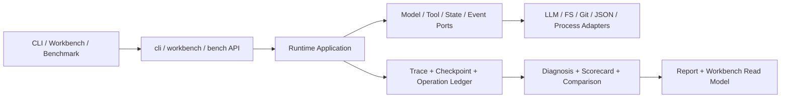

# Agent Forge 总体架构与运行链路

这是一张面向首次阅读者的总览，不再重复定义架构规则。完整依赖约束、分层标准和
完成定义见 [NanoHarness 架构契约](https://github.com/semi-hollow/NanoHarness/blob/master/docs/ARCHITECTURE.md)；方法级入口和五张地图见
[NanoHarness 代码阅读地图](NanoHarness代码阅读地图.md)。

## 一条主线



项目真正研究的是中间的 Harness 控制面：模型何时调用、看见哪些工具、操作是否允许、
中断后如何继续、多个 Agent 如何隔离协作，以及最终结论由什么证据支撑。

## 三条实际入口

### 单 Agent 主链

```text
cli.dispatch.main
-> cli.repository.run_repository_task
-> runtime.api.build_agent_loop
-> runtime.application.AgentLoop.run
-> RunPreparation
-> TurnPreparation
-> ModelPort
-> ToolExecutionPipeline
-> RunLifecycle.stop
```

### 顺序多 Agent

```text
cli.repository.run_repository_task
-> multi_agent.wiring.build_multi_agent_coordinator
-> MultiAgentCoordinator.run
-> Implementer AgentLoop
-> artifact
-> Reviewer AgentLoop
-> optional revision
-> Verifier AgentLoop
```

### 并发 Fanout

```text
validated FanoutPlan
-> LiveFanoutCoordinator.run
-> conflict-free batches
-> isolated AgentLoop workers
-> scope gate
-> deterministic integration
-> isolated finalizer
-> LiveFanoutSummary
```

## 六个能力边界

| Capability | 核心入口 | 核心所有权 |
| --- | --- | --- |
| Runtime | `runtime/application/agent_loop.py` | turn、tool intent、pause/stop、budget |
| Orchestration 编排 | `multi_agent/application/` | 角色流程、DAG、scope、merge、revision |
| Benchmark | `bench/application/swebench.py` | case 执行顺序和 official evaluation 时序 |
| Evaluation 评测 | `evaluation/application/`、`evaluation/domain/` | 指标、taxonomy、scorecard、paired comparison |
| Observability | `observability/application/usage.py` | trace 到 read model 的确定性投影 |
| Workbench | `workbench/presentation/http.py` | 只读 evidence 展示和受限命令入口 |

每个复杂 capability 遵循相同阅读顺序：

```text
api.py -> application -> domain/ports -> adapters -> wiring.py
```

## 四条结论边界

```text
candidate patch
    != local validation passed
    != runtime verifier passed
    != official benchmark resolved
```

Report、Workbench 和 case study 只能展示已有 evidence，不能把较弱事实升级成更强结论。

## 下一步阅读

1. [NanoHarness 架构契约](https://github.com/semi-hollow/NanoHarness/blob/master/docs/ARCHITECTURE.md)：为什么这样分层，以及新增代码必须遵守什么。
2. [NanoHarness 代码阅读地图](NanoHarness代码阅读地图.md)：入口图、依赖图、数据流图、状态图和所有权图。
3. [Runtime 学习路径](Runtime学习路径.md)：用实际命令和 artifact 学会 Runtime、HITL、resume 和 fanout。
4. [能力真实性矩阵](https://github.com/semi-hollow/NanoHarness/blob/master/docs/CAPABILITY_REALITY_MATRIX.md)：哪些能力真实接入，哪些边界不能夸大。
