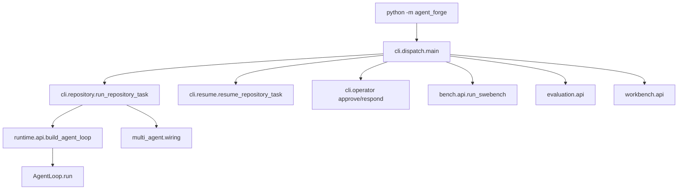
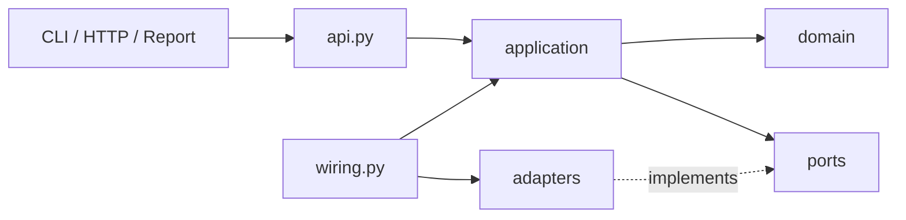
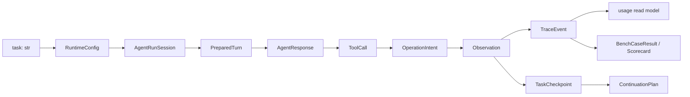
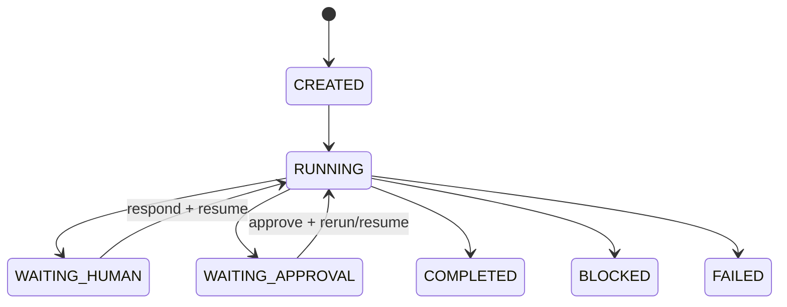

# NanoHarness 代码阅读地图

本文用于在折叠全部方法后快速重建项目全貌。架构规则见
[NanoHarness 架构契约](https://github.com/semi-hollow/NanoHarness/blob/master/docs/ARCHITECTURE.md)；本文只告诉你入口、依赖、数据、状态和
所有权实际落在哪里。

## 折叠阅读约定

| 标记 | 阅读时机 | 含义 |
| --- | --- | --- |
| `主要入口` | 第一遍 | 一项 capability 或 use case 的起点 |
| `运行时端口` | 第二遍 | 跨模块调用的策略、持久化或证据边界 |
| 无标记 | 命中该分支时 | 内部步骤，先看名字和类型即可 |
| `_` 开头 | 最后 | 私有算法或格式转换，不是稳定连接点 |

三遍阅读法：

1. 只展开主入口的签名、docstring 和顶层控制流。
2. 选择一个场景，沿 Port 或 application service 继续。
3. 只有调试具体失败时才展开 private helper 和 Adapter 存储细节。

## 地图一：运行入口图



读一个用户命令时，从 `cli/parser.py` 确认输入契约，再到 `cli/dispatch.py` 找 owner。
`forge_cli.py` 只是打包工具要求的最小控制台入口，不导出业务函数。

## 地图二：依赖图



允许方向：

```text
Presentation -> API/Application -> Domain + Ports
Wiring -> Application + Adapters
Adapters -> Domain + Ports
```

禁止方向：Domain -> Adapter、Application -> concrete JSON/Git/process store、CLI ->
capability adapter。`tests/test_architecture_boundaries.py` 会检查这些规则。

## 地图三：数据流图



核心字段 owner：

| 数据 | 定义位置 | 谁创建 | 谁消费 |
| --- | --- | --- | --- |
| `RuntimeConfig` | `runtime/config.py` | CLI/Bench | Runtime application |
| `AgentRunSession` | `runtime/application/session.py` | `RunPreparation.start` | AgentLoop、Tool pipeline、Lifecycle |
| `PreparedTurn` | `runtime/application/turn_preparation.py` | `TurnPreparation.execute` | ModelPort、AgentLoop |
| `AgentResponse/ToolCall/Observation` | `runtime/domain/conversation.py` | Model/Tool adapters | Runtime application |
| `OperationIntent` | `runtime/application/operation_tracker.py` | OperationTracker | Authorization、ledger |
| `TaskCheckpoint` | `runtime/domain/task.py` | TaskStateRepository | Lifecycle、resume、trace |
| `TraceEvent` | `observability/domain/event.py` | Event adapter | Usage、Workbench、Evaluation |
| `BenchCaseResult` | `bench/domain/models.py` | Bench use case | Diagnosis、report、scorecard |
| `EvaluationComparison` | `evaluation/domain/models.py` | Comparison rules | report/API |

## 地图四：状态流转图

### 单 Agent 状态



`RunLifecycle` 是 checkpoint 和 terminal transition 的 owner；JSON repository 只保存，
不能自行决定状态。

### 副作用 Operation 状态

```text
planned -> pending_approval -> approved -> executed
                                  |           |
                                  v           v
                                stale       failed
```

`OperationTracker` 管 operation key 和 fingerprint；`ToolAuthorizationGate` 管
allow/deny/ask；二者不能合成一个“万能安全类”。

### Fanout 编排状态

```text
validated plan -> batches -> worker accepted/rejected
-> deterministic integration -> isolated finalizer -> completed/blocked/failed
```

## 地图五：职责与所有权图

| Capability 能力 | Application owner | Domain/Port | Adapter/Presentation |
| --- | --- | --- | --- |
| Runtime | `application/agent_loop.py` | `runtime/domain`、`runtime/ports` | `runtime/adapters`、`runtime/wiring.py` |
| 上下文与记忆 | `ContextWindowManager`、`LongTermMemoryService` | `context/domain`、`context/ports` | JSON 记忆适配器、上下文公共 API |
| Orchestration | `multi_agent/application` | `multi_agent/domain`、`ports` | worker/Git/artifact adapters |
| Benchmark | `bench/application/swebench.py` | case、taxonomy、benchmark ports | 数据集/Git/model/official adapters、report |
| Evaluation | scorecard/mini-case 用例 | comparison、metric、ablation | JSON/feedback adapters、Markdown renderers |
| Observability | `BuildUsageReport` | TraceEvent、usage projection | JsonTrace、usage files、展示 renderer |
| Workbench | `WorkbenchServices` | command/job models、service ports | evidence files、后台 jobs、HTTP |

## 能力入口索引

| 能力 | 第一入口 | 下一步 | 主要输出 |
| --- | --- | --- | --- |
| CLI 参数 | `cli.parser.build_parser` | `cli.dispatch.main` | typed `Namespace` boundary |
| Repository run | `cli.repository.run_repository_task` | Runtime/Multi wiring | 运行目录 |
| Single Agent | `AgentLoop.run` | RunPreparation -> `_run_turn` | 最终答案、trace、checkpoint |
| Run 前置 | `RunPreparation.start/execute` | Lifecycle、policies、`SkillSelectorPort` | session、initial checkpoint |
| Turn 输入 | `TurnPreparation.execute` | `ContextAssemblerPort`、ToolRouter | `PreparedTurn` |
| 模型边界 | `ModelGateway.chat` | provider client | `AgentResponse`、usage |
| 工具治理 | `ToolExecutionPipeline.execute_calls` | `_execute_call` | Observation 或 StopRequest |
| 审批 | `ToolAuthorizationGate.authorize` | HookPort、ApprovalRepository | GateResult、approval event |
| 幂等 | `OperationTracker.describe/replay_if_executed` | ledger port | OperationRecord |
| 反馈恢复 | `ToolFeedback.record_recovery` | StepController | recovery event |
| 生命周期 | `RunLifecycle.update/stop/request_human_input` | state/human ports | checkpoint、pause、stop |
| Operator control | `cli.operator` | `runtime.application.operator_control` | approval/human record |
| Resume | `cli.resume.resume_repository_task` | `BuildContinuationPlan` | new run + resume chain |
| Context 上下文 | `RepositoryContextAssembler.build` | `ContextAssemblerPort` | `ContextBuildReport` |
| 完整请求预算 | `ContextWindowManager.prepare` | `PromptBudget`、`SessionDigest` | `ContextWindowResult`、checkpoint digest |
| 长期记忆 | `LongTermMemoryService.propose/promote/recall` | `LongTermMemoryRecord`、repository port | JSON record、模型只读召回视图 |
| Tool visibility 可见性 | `ToolRouter.route` | schemas、Skill tools | allowed/dropped tools |
| 弱模型 Tool Calling | `ModelGateway.chat` | `ToolCallNormalizer.normalize` | normalized call、repair retry、usage |
| Path/command safety 安全 | `WorkspaceSandbox.ensure_safe_path`、`check_command` | Permission/Environment | decision + manifest |
| Sequential roles 顺序角色 | `MultiAgentCoordinator.run` | role runner、artifact port | MultiAgentRunSummary |
| Live Fanout 并发 | `LiveFanoutCoordinator.run` | worker/workspace/artifact ports | checkpoint、integration patch、summary |
| SWE-bench 评测 | `RunSwebench.execute` | case executor、official evaluator | predictions、case results、report |
| Failure taxonomy 分类 | `classify_case_result` | priority rules | FailureDiagnosis |
| Official result 官方结果 | `apply_official_results` | official JSON parser | per-case eval status |
| Comparison 对比 | `compare_runs/compare_variants` | metric normalization | EvaluationComparison |
| Scorecard 计分卡 | `BuildBenchmarkScorecard.execute` | evidence reader port | scorecard read model |
| Ablation | `compare_benchmark_scorecards` | matched identity gate | paired delta |
| Usage 用量 | `BuildUsageReport.execute` | pure usage projection | usage.json/read model |
| Feedback data 反馈 | `record_feedback/export_feedback_dataset` | files adapter | feedback.json/JSONL |
| Workbench 工作台 | `workbench.api.run_ui` | services -> HTTP renderer | local evidence console |

## AgentLoop 最短阅读路径

```text
AgentLoop.run                         只看完整阶段
-> RunPreparation.start/execute       只看一次性初始化
-> AgentLoop._run_turn                只看 model/final/tool 分叉
-> TurnPreparation.execute            需要理解 context 时再看
-> ContextWindowManager.prepare       需要理解历史压缩时再看
-> ToolExecutionPipeline._execute_call 需要理解 action 时再看
-> RunLifecycle.stop                  需要理解终态时再看
```

`AgentLoop` 不直接保存 `JsonTaskStateRepository`、`JsonApprovalRepository` 等具体对象；这些通过
`RuntimeDependencies` 的 Port 注入。`TurnPreparation` 不扫描文件；需要理解仓库 map、
文件预览或 `FORGE.md` 读取时，再进入 `runtime/adapters/context_assembler.py`，随后沿调用
进入 Context capability。

## Context 与 Memory 最短阅读路径

```text
RunPreparation._seed_memory           召回入口
-> LongTermMemoryService.recall       权威、隔离、相关性规则
-> Memory.seed_long_term              当前 run 的只读视图
-> RepositoryContextAssembler.build   repo 与 memory 组装
-> TurnPreparation.execute            完整 turn 输入
-> ContextWindowManager.prepare       压缩旧会话但保留工具事务
-> TaskCheckpoint.context_digest      continuation 状态
```

第一遍只读 `context/domain/memory.py` 的字段和三个主要入口。JSON 文件布局、原子写入、
词项生成等实现细节不影响主链路理解，可以最后展开。

## 工具调用最短路径

```mermaid
flowchart LR
    Response["AgentResponse.tool_calls"] --> Pipeline["ToolExecutionPipeline"]
    Pipeline --> Barrier["repeat / route / HITL"]
    Barrier --> Tracker["OperationTracker"]
    Tracker --> Gate["ToolAuthorizationGate"]
    Gate --> Registry["ToolGateway.execute"]
    Registry --> Observation["Observation"]
    Observation --> Feedback["ToolFeedback"]
    Feedback --> Lifecycle["RunLifecycle"]
```



## Trace 应该怎样读

高价值 checkpoint 使用具名方法：

```python
trace.record_task_state_checkpoint(
    step=0,
    agent_name=agent_name,
    checkpoint=checkpoint,
)
```

`checkpoint` 是 `TaskCheckpoint`，字段在 Domain 中一次定义；序列化发生在
`JsonTraceRecorder`。通用 `trace.add` 仍用于扩展 event payload，但 envelope 字段由
`TraceEvent` 保护。

```text
runtime event -> trace.json (fact)
              -> BuildUsageReport (projection)
              -> usage.json (read model)
              -> Markdown/Workbench renderer (presentation)
```

Renderer 不从 patch 长度推断 solved，也不把 human feedback 当 official evaluation。

## Bench 完成顺序

```text
RunSwebench.execute
1. execute cases
2. stage predictions
3. optionally run official evaluator
4. attach final diagnosis and write case study
5. aggregate and publish reports
```

Case study 位于 final evaluation 之后，避免保存 stale `not_evaluated` 结论。

## 首次阅读清单

1. `docs/ARCHITECTURE.md`
2. `agent_forge/cli/dispatch.py`
3. `agent_forge/cli/repository.py`
4. `agent_forge/runtime/application/agent_loop.py`
5. `agent_forge/runtime/application/session.py`
6. `agent_forge/runtime/application/run_preparation.py`
7. `agent_forge/runtime/application/turn_preparation.py`
8. `agent_forge/runtime/application/tool_execution.py`
9. `agent_forge/runtime/application/run_lifecycle.py`
10. `agent_forge/multi_agent/application/coordinator.py`
11. `agent_forge/multi_agent/application/live_fanout.py`
12. `agent_forge/bench/application/swebench.py`
13. `agent_forge/evaluation/application/scorecard.py`
14. `agent_forge/observability/application/usage.py`
15. `agent_forge/workbench/presentation/http.py` 中当前需要的 renderer

读每个函数只回答四个问题：输入类型是什么、返回类型是什么、可能产生什么副作用、
下一步由哪个 owner 接管。无法从签名和所在层回答时，优先改善代码契约，而不是继续
增加解释性注释。
