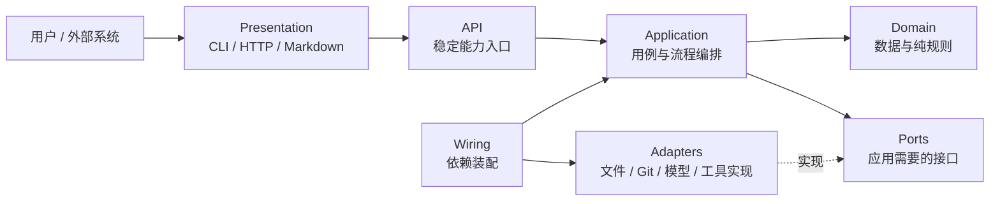
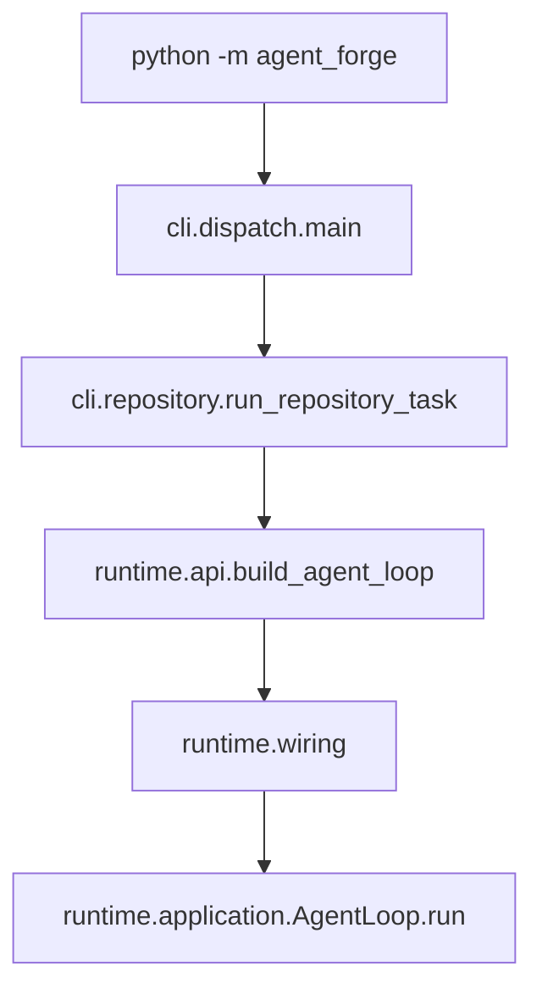
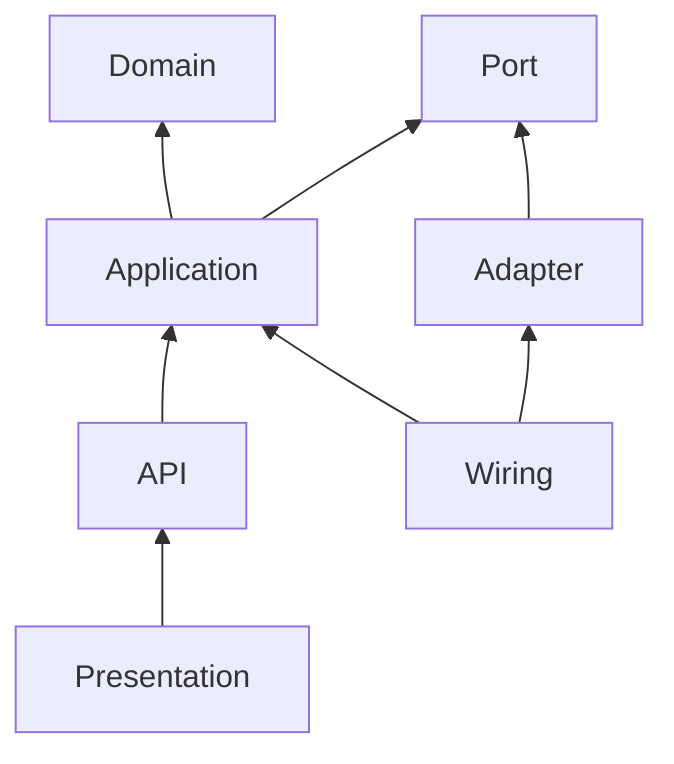
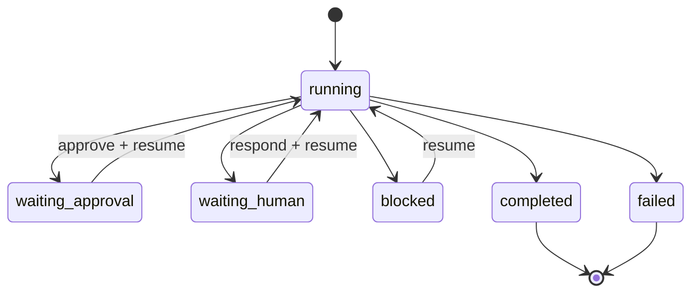

# Python 分层与调用关系

NanoHarness 采用的是 **按能力分包，包内轻量六边形分层**。它不是 Python 官方规定，
也不是完整 DDD。目标只有两个：让调用方向稳定，让读者能先看主流程、后看实现细节。

## 一句话总图



正常运行方向是：

```text
外部请求 -> Presentation -> API -> Application -> Domain / Port
                                      ^
                                      |
                              Wiring 注入 Adapter
```

Application 只知道“我需要保存 checkpoint”，不知道“JSON 文件具体怎么写”。
`Port` 描述前一个需求，`Adapter` 完成后一个实现。

## 每层到底是什么

| 层 | 回答的问题 | Java 类比 | NanoHarness 示例 |
|---|---|---|---|
| `domain/` | 系统里有哪些数据和不依赖 IO 的规则？ | Entity、Value Object、Domain Policy | `TaskCheckpoint`、`ToolCall`、failure taxonomy |
| `application/` | 一个用户目标按什么顺序完成？ | Application Service、Use Case | `AgentLoop.run`、`RunSwebench.execute` |
| `ports/` | Application 需要外界提供什么能力？ | Repository 接口、Gateway 接口 | `TaskStateRepository`、`ModelPort`、`ToolPort` |
| `adapters/` | 文件、Git、HTTP、模型等具体怎么做？ | RepositoryImpl、Client、DAO | `JsonTaskStateRepository`、`LocalAgentWorkerAdapter` |
| `presentation/` | 外部输入怎样进入，结果怎样展示？ | Controller、CLI、View、DTO mapper | CLI 参数、HTTP handler、Markdown renderer |
| `api.py` | 外围模块应该从哪里调用这个能力？ | 稳定 Facade，但不做旧接口兼容 | `build_agent_loop`、`run_swebench` |
| `wiring.py` | 谁把 Use Case 和具体 Adapter 组装起来？ | Spring `@Configuration`、Bean 装配 | `build_runtime_dependencies` |

### Domain

Domain 只保存“事实”和“规则”。它可以使用标准库，但不能读取文件、运行 Git、调用模型，
也不能反向导入 Application 或 Adapter。

判断方式：给这个函数输入普通 Python 数据，它是否能在无网络、无磁盘的环境中确定性返回？
如果能，它通常属于 Domain。

### Application

Application 表达用例顺序，例如：准备运行、调用模型、授权工具、保存状态、停止。
它可以修改运行状态，但外部副作用必须通过 Port 完成。

Application 不是“所有业务代码的杂物间”。一个类应拥有一个清晰流程，复杂策略应下沉到
Domain，外部细节应下沉到 Adapter。

### Port

这里的 Port 不是网络端口，而是 **Application 对外部世界提出的接口**。接口由使用方
拥有，因此放在能力包内部，而不是放到具体实现旁边。

```python
class TaskStateRepository(Protocol):
    def save(self, checkpoint: TaskCheckpoint) -> None: ...
```

读 Port 时只需要知道“用例依赖什么”，不需要追文件格式。

### Adapter

Adapter 实现 Port，把外部系统转换成项目内部契约。例如 JSON 文件、Git worktree、
OpenAI-compatible API、MCP stdio 都属于 Adapter。

Adapter 可以依赖第三方库和操作系统，但异常应在这里被归一化，不能把零散实现细节直接
泄漏给 AgentLoop。

### Presentation

Presentation 不只指网页前端。CLI 参数解析、HTTP 请求处理、Markdown/HTML 报告渲染
都属于展示层。它负责输入输出格式，不负责决定 Agent 如何执行。

### API 与 Wiring

`api.py` 是读者和其他能力包的门口；`wiring.py` 是组装依赖的地方。

- 想“使用能力”：先看 `api.py`。
- 想“理解依赖怎么接上”：再看 `wiring.py`。
- 想“理解流程”：进入 `application/` 的主要入口。
- 想“理解数据”：进入 `domain/`。
- 想“理解文件/Git/模型细节”：最后看 `adapters/`。

项目不再保留 `runtime/agent_loop.py`、`bench/swebench.py` 这类旧路径转发壳。
同一能力只有一个正式入口，避免 IDE 搜索出现两套真假难辨的调用链。

## 四张项目地图

### 1. 运行入口图



### 2. 依赖图



箭头表示“代码依赖”。Domain 不应指向任何上层或基础设施。

### 3. 数据流图

```text
Task
-> RuntimeConfig
-> Message / ContextBuildReport
-> AgentResponse / ToolCall
-> Observation
-> TraceEvent + TaskCheckpoint + OperationRecord
-> Candidate Patch
-> Validation Evidence
-> Report / UI
```

### 4. 状态流转图



## 三条真实调用链

### 单 Agent 与 HITL

```text
cli.repository.run_repository_task
-> runtime.api.build_agent_loop
-> runtime.wiring.build_runtime_dependencies
-> AgentLoop.run
-> ToolExecutionPipeline / RunLifecycle
-> HumanInputRepository 或 ApprovalRepository Port
-> JsonHumanInputRepository / JsonApprovalRepository Adapter
```

### Live Fanout

```text
cli.repository.run_repository_task
-> multi_agent.api.build_live_fanout
-> multi_agent.wiring.build_live_fanout
-> LiveFanoutCoordinator.run
-> LocalAgentWorkerAdapter
-> 每个隔离 worktree 内的 AgentLoop.run
-> 冲突检查、确定性合并、finalizer
```

### Benchmark 与评测闭环

```text
bench.presentation.cli
-> bench.api.run_swebench(SwebenchRunRequest)
-> bench.wiring.build_swebench_runner
-> bench.application.RunSwebench.execute
-> CaseExecutor / OfficialEvaluator / Artifact Port
-> Adapter 实现
-> Evaluation comparison / scorecard
-> Report 与 Workbench UI
```

## Collapse All 后怎么读

1. 先展开目标能力的 `api.py`，只找带“主要入口”标记的方法。
2. 展开 `wiring.py`，看这个入口注入了哪些 Port 和 Adapter。
3. 进入 `application/`，只读 `run` 或 `execute`，先口述阶段顺序。
4. 遇到不认识的数据名，再打开 `domain/` 对应 dataclass。
5. 只有需要理解文件格式、Git、网络或并发细节时才打开 `adapters/`。
6. `ports/` 用来回答“这个流程依赖了什么”，通常不需要逐行研究。

以 Runtime 为例，第一遍只看：

```text
runtime/api.py: build_agent_loop
-> runtime/wiring.py: build_runtime_dependencies
-> runtime/application/agent_loop.py: AgentLoop.run
-> runtime/application/agent_loop.py: _run_turn
```

此时已经能理解主链。JSON 保存、Git、审批文件等实现细节可以暂时折叠。

## 防止架构再次劣化

1. Domain 不导入 Adapter、Presentation、CLI 或具体工具。
2. Application 不直接创建 JSON Repository、Git Client 或 HTTP Client。
3. Presentation 不实现 Agent 决策和状态迁移。
4. Adapter 不替 Application 决定业务流程。
5. 跨 capability 调用优先经过对方 `api.py`。
6. 只有 `wiring.py` 同时认识 Application 和具体 Adapter。
7. 不为目录对称强造空层；没有外部依赖的简单能力可以只保留 Domain 函数。
8. 不保留长期兼容 facade；重命名时同步迁移调用方和测试。
9. 主要入口必须有类型标注、中文职责说明和源码导航标记。
10. 架构规则必须由 `tests/test_architecture_boundaries.py` 等测试执行，而不只写在文档里。
