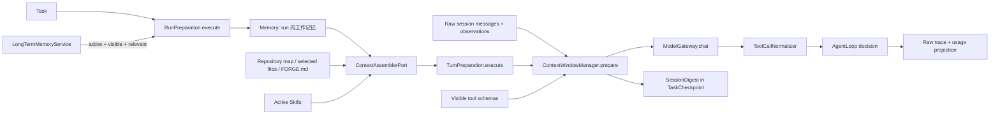

# 上下文、记忆与模型适配

本文只描述已经接入 `AgentLoop` 的真实能力。阅读目标是回答四个问题：模型每一轮看见
什么，历史过长时怎样压缩，哪些信息有资格成为长期记忆，以及弱模型的 Tool Calling
异常在哪里被治理。

## 一张总图



## 五类状态不要混在一起

| 状态 | 数据结构 | 生命周期 | 真相边界 |
| --- | --- | --- | --- |
| 当前任务输入 | `Message(role="user")` | 当前 run | 原始输入是事实，模型解释不是事实 |
| Working Memory | `Memory` | 进程内当前 run | 只保存任务、session 摘要和已召回长期记忆视图 |
| 会话历史 | `Message` + `Observation` | 当前 run，原始记录进入 trace | 原始消息与工具结果是权威证据 |
| 压缩摘要 | `SessionDigest` | checkpoint + 当前模型请求 | 是有 source hash 的派生视图，不能替代 raw trace |
| 长期记忆 | `LongTermMemoryRecord` | 跨 run 文件存储 | 只有带证据的 `active` 记录可以召回 |

`TaskCheckpoint` 属于恢复状态，不等于长期知识。它保存当前步骤、终态、恢复提示和最近
的 `SessionDigest`，用于创建新的 continuation；它不声称恢复 provider 的隐藏 KV Cache、
模型思维或被终止的 Python 进程。

## 完整请求预算与压缩

静态 Context Builder 先对 system policy、permission、Skill、长期记忆、FORGE.md、文件
preview、retrieval 和 working memory 做结构化区段分配，保证 system message 自身不超过
`max_context_chars`；任务只保留在原始 user message，不在 system 区段重复。

随后由 `ContextWindowManager.prepare` 治理完整请求。预算对象不只是文件片段：

```text
system context + raw conversation + tool schemas + reserved output
```

处理顺序：

1. 使用统一近似估算输入 token，并保留输出预算。
2. 未达到 soft limit 时原样发送。
3. 接近窗口时，从旧历史开始寻找安全切点。
4. Assistant 的 tool intent 与对应 tool result 被视为不可拆分事务。
5. 被移出的历史转换为结构化 `SessionDigest`，保留任务、用户更新、工具事务、失败、
   assistant 更新和原始内容哈希。
6. 原始 session 与 trace 不删除；模型只看压缩后的请求视图。
7. Provider 仍返回 context overflow 时，`AgentLoop` 强制做一次更激进压缩；只有 token
   估算确实下降才重试一次。

这是确定性压缩，不是 LLM 自由摘要。优点是可复现、不会在压缩阶段再引入模型幻觉；
代价是语义抽取能力有限。Token 数是调用前近似值，provider usage 才是调用后权威值。

## 长期记忆的权威生命周期

主要入口是 `LongTermMemoryService`：

```text
propose(candidate)
    -> promote(active, evidence required)
    -> supersede / retire
    -> recall(active + non-expired + namespace-visible + relevant)
```

- `candidate` 不进入模型上下文，避免模型一句话直接污染长期真相。
- `promote` 必须附带 evidence；本地文件证据记录绝对路径和 SHA-256。
- 相同 namespace、scope、agent 和 key 的旧 active 记录会变成 `superseded`。
- `workspace` 记忆对该 namespace 的 Agent 可见；`agent_private` 还要求 agent 名称匹配。
- TTL 到期、retired、rejected 和 candidate 记录不会召回。
- 召回使用透明的中英文词项相关度、confidence 和 importance 排序，不声称向量 RAG。

默认 repository run 使用原始 workspace 作为 namespace。Benchmark 默认
`memory_recall_limit=0`，防止开发者机器上的记忆静默污染评测；显式 Memory 消融必须使用
同一份 memory snapshot SHA-256，只改变 recall limit。

## 弱模型 Tool Calling 适配

主要入口是 `ModelGateway.chat` 和 `ToolCallNormalizer.normalize`。治理顺序如下：

1. Provider client 解析原生 tool call。
2. JSON object 参数直接通过；Python dict literal 只使用 `ast.literal_eval` 做确定性修复。
3. 纯文本只有在完整匹配一个 JSON tool call 且工具名属于本轮可见集合时才提升为调用。
4. 工具名未知、参数缺失或无法安全解析时，不猜测业务参数，返回 `invalid_tool_call`。
5. HTTP 边界先区分 context overflow、429、timeout、5xx 和一般请求失败。
6. Gateway 使用明确 repair prompt 做有界重试；429/timeout/5xx 走 transport retry。
7. Context overflow 不在 Gateway 重试或 fallback，由 `AgentLoop` 压缩后接管。
8. 单次响应包含过多调用时，`ToolExecutionPipeline` 只执行配置允许的前 N 个；HITL
   仍然是优先 barrier。

每次失败和成功的模型调用都进入 usage。内部 repair retry、overflow recovery、tool burst
截断、最终成本和响应标准化信息可以在 Evidence Console 直接查看。

## 怎样证明能力有效

单元测试只证明契约没有退化；效果结论必须来自 matched run：

| Factor | 允许改变 | 必须保持一致 |
| --- | --- | --- |
| `memory` | `memory_recall_limit` | memory namespace 与 snapshot SHA-256 |
| `context-window` | 最大窗口与输出预留 | case、模型、工具、Skill、Memory |
| `skills` | Skill mode、名称、manifest SHA-256 | 其余 runtime 配置 |
| `tool-call-budget` | 每 turn 最大工具数 | 模型、case 和其他控制策略 |

Scorecard 同时报告 official correctness、local evidence、token、cost、latency、tool failure、
compaction、memory recall 和 repair。Memory 被召回不等于结果改善；Skill 被激活也不等于
步骤减少。只有同 case、同模型、同环境的 paired official evidence 才能支持质量结论。

## 当前边界

- 没有用户画像、组织知识、跨租户共享记忆或凭证系统。
- 没有向量数据库、知识图谱、learned reranker 或自动跨项目召回。
- Runtime 不允许模型自动晋升长期记忆，也没有“自动修改自身 Harness”的自进化。
- 没有恢复 provider KV Cache；resume 是有 provenance 的新 run。
- 模型适配不是 provider-specific prompt tuning 平台，只治理 OpenAI-compatible 边界上最常见、
  可确定修复的协议错误。

## 最短阅读路径

```text
RunPreparation._seed_memory
-> LongTermMemoryService.recall
-> Memory.seed_long_term
-> TurnPreparation.execute
-> ContextWindowManager.prepare
-> AgentLoop._run_turn
-> ModelGateway.chat
-> ToolCallNormalizer.normalize
-> ToolExecutionPipeline.execute_calls
-> build_usage_report
```

数据结构先看 `context/domain/memory.py`；文件持久化只在需要验证原子写入或 namespace
布局时再看 `context/adapters/memory_json.py`。
