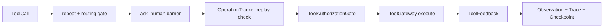

# Runtime 能力导览

本文只回答“某项 Runtime 能力落在哪、入口是什么、与谁关联”。架构规则见
[NanoHarness 架构契约](https://github.com/semi-hollow/NanoHarness/blob/master/docs/ARCHITECTURE.md)，动手练习见
[Runtime 学习路径](../architecture/Runtime学习路径.md)。

## Runtime 内部结构

```text
runtime/
├── api.py                         外围稳定入口
├── domain/                        Task、Conversation、Approval、Operation 等纯模型
├── application/
│   ├── agent_loop.py              主控制流
│   ├── run_preparation.py         session 与一次性前置决策
│   ├── turn_preparation.py        routing、context、plan
│   ├── tool_execution.py          工具治理顺序
│   ├── tool_authorization.py      hook + approval gate
│   ├── operation_tracker.py       side-effect identity 与 ledger
│   ├── tool_feedback.py           observation、recovery、validation evidence
│   ├── final_answer.py            final claim 校验
│   ├── run_lifecycle.py           checkpoint、HITL、terminal transition
│   └── operator_control.py        approve/respond/resume 用例
├── ports/                         Model、Tool、Context、Skill、State、Event、Hook、Environment 协议
├── adapters/                      JSON repositories、repository context 读取
└── wiring.py                      具体装配
```

## 第一遍只看这些入口

| 顺序 | 方法 | 看懂什么 |
| ---: | --- | --- |
| 1 | `cli.dispatch.main` | 用户命令如何分发 |
| 2 | `cli.repository.run_repository_task` | 环境、模型、工具、运行模式如何装配 |
| 3 | `runtime.wiring.build_agent_loop` | Adapter 如何注入 Port |
| 4 | `AgentLoop.run` | start、prepare、turn、stop 的完整骨架 |
| 5 | `RunPreparation.start/execute` | 初始化 checkpoint，并通过 Skill Port 完成 guardrail、clarification、Skill、memory |
| 6 | `TurnPreparation.execute` | 通过 Context Port 获取 repo context，并调用完整请求窗口治理 |
| 7 | `ToolExecutionPipeline.execute_calls` | 工具治理的固定顺序 |
| 8 | `RunLifecycle.update/stop/request_human_input` | durable state 的唯一 owner |

这八个入口足以建立全貌。JSON 文件命名、原子写入和具体 fingerprint 算法只在调试
对应分支时阅读。

Context 与 Memory 的单独链路见
[上下文、记忆与模型适配](../architecture/上下文记忆与模型适配.md)。最重要的三个入口是
`LongTermMemoryService.recall`、`ContextWindowManager.prepare` 和
`ToolCallNormalizer.normalize`。

## 工具治理链



| 责任 | Owner | 不负责 |
| --- | --- | --- |
| 调用顺序 | `ToolExecutionPipeline` | 审批文件格式 |
| allow/deny/ask | `ToolAuthorizationGate` | 工具实现 |
| operation key、fingerprint、replay | `OperationTracker` | 人工回答 |
| 模型可见 feedback、recovery、test evidence | `ToolFeedback` | terminal state |
| checkpoint 和 pause/stop | `RunLifecycle` | 工具 routing |

## 两类 Human-in-the-loop

| 类型 | Domain object | Application entry | Adapter | 恢复方式 |
| --- | --- | --- | --- | --- |
| 信息补充 | `HumanInputRequest` | `RunLifecycle.request_human_input` | `JsonHumanInputRepository` | `forge respond` 后 `forge resume` |
| 副作用授权 | `ApprovalRequest` | `ToolAuthorizationGate.authorize` | `JsonApprovalRepository` | `forge approve` 后重新运行或恢复 |

二者都能暂停，但语义不同：回答问题不能授权写操作，批准一个 operation 也不能被当成
一般任务信息。

## Recovery 与幂等

```text
TaskCheckpoint         解释任务停在哪里
HumanInputRequest      解释缺什么信息
ApprovalRequest        解释哪个副作用等待授权
OperationRecord        解释副作用是否已执行、目标是否漂移
resume_link.json       解释新 run 从哪一个 run 继续
```

`forge resume` 创建的是新 run。它恢复显式 checkpoint 和人工输入，不恢复隐藏模型状态、
Python 调用栈或进程内存。

## 与其他 Capability 的连接

| Runtime 输出 | 消费方 | 用途 |
| --- | --- | --- |
| `AgentLoop` | Sequential Coordinator / Fanout worker / Benchmark | 复用同一控制内核 |
| `TraceEvent` | Observability | 构造 usage 与 timeline read model |
| candidate patch | Benchmark / Orchestration | official eval 或 deterministic merge |
| checkpoint | CLI resume / Fanout recovery | 显式 continuation |
| operation ledger | Runtime replay gate | 防止重复副作用 |
| approval/human request | CLI operator commands | 人工控制 |

## 调试入口

| 现象 | 先看 |
| --- | --- |
| 模型没看到仓库内容或工具 | `TurnPreparation.execute`、`ContextAssemblerPort` 和 `ToolRouter.route` |
| 长会话溢出或压缩丢信息 | `ContextWindowManager.prepare`、`SessionDigest` 和 `context_window` event |
| 长期记忆未召回或串项目 | `LongTermMemoryService.recall`、namespace/scope/status/TTL |
| 弱模型工具参数异常 | `ModelGateway.chat`、`ToolCallNormalizer.normalize` 和 response normalization |
| 工具被拒绝 | `ToolAuthorizationGate.authorize`、`HookManager.pre_tool` |
| 写操作重复或 stale | `OperationTracker.replay_if_executed` |
| 回答后仍然停住 | `BuildContinuationPlan.execute` 与 checkpoint metadata |
| 最终答案暗示已验证 | `FinalAnswerBuilder.execute` 与 report claim ladder |
| trace 有事件但 usage 没展示 | `BuildUsageReport.execute` 与 usage renderer |

对应的历史 failure scenario、根因和验证记录统一维护在
[失败驱动的 Runtime 改进记录](https://github.com/semi-hollow/NanoHarness/blob/master/docs/evaluation/failure-driven-improvements.md)。
