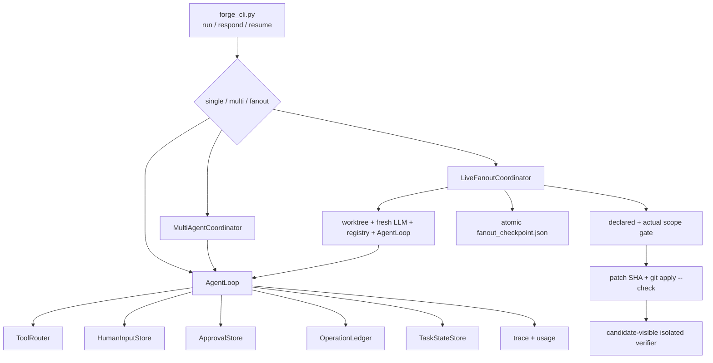

# 最近新增 Agent 能力完整代码导览

目标：用最短路径读懂 2026-07-12 后 NanoHarness 新增的 durable human
input、真实 AgentLoop fanout、partial recovery、conflict gate、统一 Git patch
证据、candidate-visible finalizer 和恢复成本口径。以下状态以当前代码和
行为测试为准。

## 先记住六条真实性边界

1. `ask_human` 已不再返回模拟答案；真实信息澄清由 `HumanInputStore` 持久化。
2. `ApprovalStore` 是写操作授权，`HumanInputStore` 是信息输入，两者不能混讲。
3. fanout 已接入真实 `AgentLoop` worker，但它是本地协调器，不是分布式 swarm。
4. fanout 的 durable clarification 可跨 run 恢复；ephemeral worktree 上的逐操作
   手工写审批仍不安全，因此当前明确 fail-fast。
5. `ask_human` 是同一 model turn 的副作用屏障；同轮其他工具不会先执行。
6. worker 消费的是 committed `base_head`，不会悄悄继承主 checkout 未提交文件。

## 总览图



## 最短阅读顺序

| 顺序 | 文件 | 重点 |
| ---: | --- | --- |
| 1 | `agent_forge/forge_cli.py` | parser 中 fanout/respond 参数；`run_repository_task()` 的三模式 dispatch |
| 2 | `agent_forge/runtime/human_input.py` | request identity、terminal states、atomic write、path validation |
| 3 | `agent_forge/runtime/agent_loop.py` | pre-loop clarification、tool-level interception、WAITING_HUMAN、response load |
| 4 | `agent_forge/runtime/approval.py` | 写操作批准、fingerprint 和 stale approval，对比 HumanInput |
| 5 | `agent_forge/multi_agent/fanout.py` | 拓扑 batch、declared overlap 分批、dynamic overlap 算法 |
| 6 | `agent_forge/multi_agent/live_fanout.py` | worktree worker、merge、checkpoint、resume、finalizer |
| 7 | `agent_forge/runtime/git_workspace.py` | tracked + untracked text/binary patch 的统一事实来源 |
| 8 | `agent_forge/runtime/execution_environment.py` | outer/worker/finalizer worktree 的真实隔离边界 |
| 9 | `agent_forge/observability/usage_report.py` | worker/finalizer usage 的来源 |
| 10 | `tests/test_human_input.py` | HITL 行为规格 |
| 11 | `tests/test_live_fanout.py` | fanout 行为规格，优先读这个 |
| 12 | `tests/test_git_workspace.py` | 新建文件、binary patch、runtime artifact 排除 |

## Durable Human Input

### 调用链

```text
ClarificationPolicy 或模型 ask_human
  -> AgentLoop._request_human_input()
  -> HumanInputStore.request()
  -> request JSON 原子落盘
  -> checkpoint metadata 写 request_id
  -> TaskRunStatus.WAITING_HUMAN
  -> 停止后续工具
  -> forge respond <id> --answer <text>
  -> forge resume <run-dir>
  -> continuation task 注入 Question + Answer
```

如果同一模型响应还带有 `write_file/apply_patch`，AgentLoop 只处理第一个
`ask_human`，其他调用记为 deferred。回答载入后模型必须重新提出写操作，
避免“先写后问”。question/choices 也在持久化前严格验证。

### 为什么不使用阻塞 `input()`

- worker 可能在后台线程或远程执行，不能占住终端。
- 请求要跨进程存在，方便 operator 稍后回答。
- trace/checkpoint 必须先于停止落盘。
- 取消和回答是 terminal state，不能被下一次 run 悄悄重置。

### 请求身份

request id 包含 stable thread、kind、question 和 normalized choices。choices
改变会得到新请求；CLI request id 只能是 24 位十六进制，不能用 `../` 越出
store root。

### 面试短答

> 我把 ask-human 做成 runtime control event，而不是普通工具返回。问题先持久化，
> run 转为 waiting_human 并停止；人工回答后，新 run 从显式 checkpoint 和回答
> 继续。它不恢复隐藏思维，也不把信息输入误当成写操作授权。

## Clarification 和 Approval 的区别

| 维度 | HumanInputStore | ApprovalStore |
| --- | --- | --- |
| 问题 | 继续任务需要什么信息 | 是否授权一个具体副作用 |
| 关键字段 | thread/question/choices/answer | operation key/arguments/fingerprint/decision |
| stale 语义 | choices 或 thread 变化产生新 request | target fingerprint 变化使旧 approval stale |
| CLI | `forge respond` | `forge approve` |
| 恢复 | 回答注入 continuation | 执行前重新检查目标状态 |

不要说“ask_human 就是 approval tool”。这是两个不同控制面。

## Live Fanout 到底做了什么

### 输入不是自然语言 plan 列表

它消费显式 JSON DAG：task id、depends_on、write_scope、allowed_tools、
expected_artifact 和 `max_steps`。worker 实际预算是
`min(global_max_steps, task.max_steps)`，不把 prompt 里的“最多 N 步”当治理。

### Worker 不是 callback

每个 worker 都有：

- detached git worktree；
- fresh LLM/ModelGateway；
- fresh ToolRegistry 和 task tool allowlist；
- 真实 AgentLoop；
- 独立 task state、trace、usage、artifact、patch 和 environment manifest。

只有 worktree add/remove 进入 Git lock，LLM 调用和工具执行保持并发。共享一个
ModelGateway 会竞争可变 `last_usage`，共享 workspace 会产生真实写竞争。

worktree 从记录的 `base_head` 创建。它看不到另一 checkout 的 uncommitted
index/worktree 状态。write fanout 对 dirty integration workspace fail closed；如果未来
要支持 draft input，应把 dirty diff 变成显式、有 hash 的 seed artifact。

### Batch 和 conflict policy

```text
topological ready level
  -> first-fit partition by declared write_scope
  -> disjoint tasks concurrent
  -> actual touched files recheck
  -> same-batch dynamic overlap check
  -> git apply --check
  -> deterministic plan-order apply
```

- declared overlap：串行化，因为双方已经承认拥有同一路径。
- actual scope escape：不合并，因为 plan 所有权已失真。
- undeclared overlap：`conflict_resolution_required`，不让 LLM 自动扩权。
- patch apply failure：保留 artifact，停止 merge。

### 为什么没有自动 conflict-resolver agent

冲突解决本身可能跨越两个任务的 scope。让一个模型自动改会把“明确所有权”变成
“临时无限权限”。当前更稳妥的设计是记录冲突并交给 operator 重新划分任务或
创建显式依赖。

## Fanout Partial Recovery

### 增量证据

```text
fanout_plan.json
fanout_checkpoint.json
fanout_summary.json
workers/<task>/patch.diff
workers/<task>/trace.json
integration.patch
```

checkpoint 在运行开始和每个 batch 后原子更新。accepted patch 保存 SHA-256。
恢复必须同时匹配：

1. normalized plan digest；
2. base commit；
3. patch 文件存在；
4. patch SHA-256；
5. patch 能在 fresh integration workspace 应用。

满足后跳过 completed task，只重跑 incomplete/blocked task。checkpoint 恢复的
是显式 artifact，不是线程栈、模型 KV cache 或隐藏思维。

恢复先在 disposable validation worktree 中验证并顺序重放所有 accepted patch，
再把最终 combined diff 一次应用到 integration workspace。这样第二个 patch 被
篡改时，不会先把第一个 patch 留在真实 workspace。

### Fanout worker 的 human response

worker thread id 使用 `plan digest + base commit + task id`，不使用 run id。
因此 matching resume 再次产生同一个问题时，可以从共享 HumanInputStore 读取
responded answer 后继续。

### 硬中断边界

进程被 kill 后，最近一个完整 batch 可恢复；正在执行的 batch 可能重跑。旧
worktree 可能成为 orphan，需要只清理 Agent Forge 自己创建的 stale worktree。

## 为什么逐操作手工写审批没有接入 fanout resume

当前 operation key/fingerprint 与实际 workspace 相关。fanout 每次重跑都会
创建新 worktree；直接复用旧 approval 可能把“批准旧中间状态”套到“重新生成的
新中间状态”。所以 write fanout 遇到 `--no-auto-approve-writes` 会 fail-fast。

面试时这样说：

> 这不是没想到 HITL，而是 authorization identity 尚未稳定。fanout 目前用
> worktree、write scope、deterministic merge gate 控制写入；需要逐操作人工
> 授权时切回 single/sequential。下一步要设计 workspace-independent operation
> identity 和版本化 precondition，不能只把 approval root 改成共享目录。

## 统一 Git Patch 证据

旧 `git diff` 看不到 untracked new file，会导致：

- worker 新建文件被判 `no_patch`；
- 下游 dependency worker 看不到新文件；
- SWE-bench prediction 与 UI/git_diff 的事实不一致。

`runtime/git_workspace.py` 现在统一收集 HEAD-relative tracked diff，加上每个
untracked text/binary file 的 no-index binary patch。它服务 normal run、
SWE-bench、GitDiffTool、sequential coordinator 和 live fanout。

只排除未跟踪的 `.agent_forge` runtime artifacts；如果这些文件已被仓库跟踪，
其改动仍正常显示，避免隐藏用户事实。

## Finalizer 为什么也用 worktree

“只给 read tools”不等于文件系统无副作用。测试和 diagnostics 可能产生 cache。
finalizer 在 disposable worktree 中应用 integrated candidate，但不提交，因此
`git_diff` 能直接看到候选修改。runtime 保存运行前 binary patch snapshot，运行
后再采集一次；两者不同则 decision 变为 BLOCKED，workspace 被丢弃。

恢复 run 的 metrics 分三层：原名字段是本次 workers + finalizer，`resumed_*`
是复用的历史用量，`evidence_chain_*` 是完整证据链。
`worker_time_to_wall_ratio` 只用本次 worker，且仍不能在没有 matched serial
baseline 和重复实验时宣称 speedup。

## 运行和看证据

```bash
cd /Users/chenjiahui/Documents/GitHub/NanoHarness
source .venv/bin/activate

forge run "audit runtime and safety evidence" \
  --agent-mode fanout \
  --fanout-plan examples/fanout-plan.sample.json \
  --max-workers 2 \
  --provider deepseek
```

优先看：

1. `fanout/fanout_report.md`
2. `fanout/fanout_summary.json`
3. `fanout/fanout_checkpoint.json`
4. `fanout/workers/<id>/trace.json`
5. `fanout/workers/<id>/usage.json`
6. `fanout/integration.patch`
7. `fanout/finalizer/verification.md`

恢复命令：

```bash
forge run "continue the validated task DAG" \
  --agent-mode fanout \
  --fanout-plan path/to/plan.json \
  --fanout-resume .agent_forge/runs/<previous-run-id> \
  --execution-mode worktree \
  --no-keep-worktree \
  --provider deepseek
```

## 测试地图

```bash
.venv/bin/python -m unittest \
  tests.test_human_input \
  tests.test_human_approval \
  tests.test_operation_ledger \
  tests.test_subagent_fanout \
  tests.test_live_fanout \
  tests.test_git_workspace \
  tests.test_public_cli -v
```

重点 case：

| 问题 | 测试 |
| --- | --- |
| 不回答时不能继续 | `test_preloop_clarification_persists_request_before_model_call` |
| 同轮先问再做副作用 | `test_human_control_signal_defers_same_turn_side_effects` |
| 坏 choices 不落盘 | `test_invalid_tool_level_choices_do_not_create_a_request` |
| cancelled 不能复活 | `test_existing_response_continues_but_cancelled_question_stays_terminal` |
| 真 AgentLoop/worktree 并发 | `test_real_agentloop_workers_use_isolated_worktrees_and_merge_disjoint_patches` |
| task 步数预算 | `test_worker_uses_plan_step_budget_instead_of_global_ceiling` |
| scope escape 不合并 | `test_scope_escape_fails_closed_without_merging_patch` |
| checkpoint-only selective resume | `test_resume_reapplies_completed_patch_and_only_reruns_incomplete_worker` |
| tampered patch 拒绝 | `test_resume_rejects_a_tampered_completed_patch` |
| worker human response 跨 run | `test_fanout_resume_reuses_a_durable_worker_human_response` |
| finalizer 看到 candidate diff | `test_finalizer_can_inspect_integrated_candidate_diff` |
| 新 text/binary 文件进入 patch | `tests/test_git_workspace.py` |

## 面试回答模板

### 多 Agent 并发做到什么程度

> 我实现的是 coordinator-driven local fanout。输入是显式 DAG，独立 task 使用
> 独立 worktree、模型上下文和 AgentLoop 并发执行；scope 重叠串行，实际越界或
> merge failure fail closed。它不是 swarm，也不做无界动态拆解。

### Partial recovery 怎么证明

> 每批完成后写 atomic checkpoint，记录 plan/base 和 accepted patch hash。恢复
> 在 fresh workspace 校验并重放 completed patch，只重跑 incomplete worker。
> 我有 checkpoint-only、plan mismatch 和 patch tamper 行为测试。

### HITL 是真的还是模拟的

> 信息澄清是真实 pending/responded/cancelled state，AgentLoop 会停止，CLI 回答
> 后才能 resume；写操作审批是另一个带 fingerprint 的授权状态机。fanout 中
> ask_human 还会拦住同轮其他副作用。durable clarification 可恢复，跨
> ephemeral worktree 的逐操作写审批暂不冒充
> 已支持。

### 如何证明并发更好

> 当前只记录 wall time、summed worker time、token/cost、tool failure 和 merge
> outcome。没有 matched serial 多次实验前，我不把 ratio 说成 speedup，也不
> 声称 multi-agent 普遍提高质量。

## 不要误讲

| 错误说法 | 准确说法 |
| --- | --- |
| “实现了分布式 multi-agent 平台” | “实现了本地、隔离、证据化的 live fanout coordinator。” |
| “模型自动拆 plan 并解决冲突” | “消费显式 validated DAG；冲突 fail closed 或重新划 scope。” |
| “resume 恢复了 Agent 思考” | “恢复 checkpoint 和 hash-verified artifacts。” |
| “HITL 已覆盖所有 fanout 写操作” | “clarification 可恢复；逐操作写授权在 fanout 明确拒绝。” |
| “并发 ratio 就是性能提升” | “需要 matched serial baseline 和重复实验后才能谈 speedup。” |
| “verifier PASS 等于 solved” | “它是 runtime evidence；official resolved 仍需官方 harness。” |
